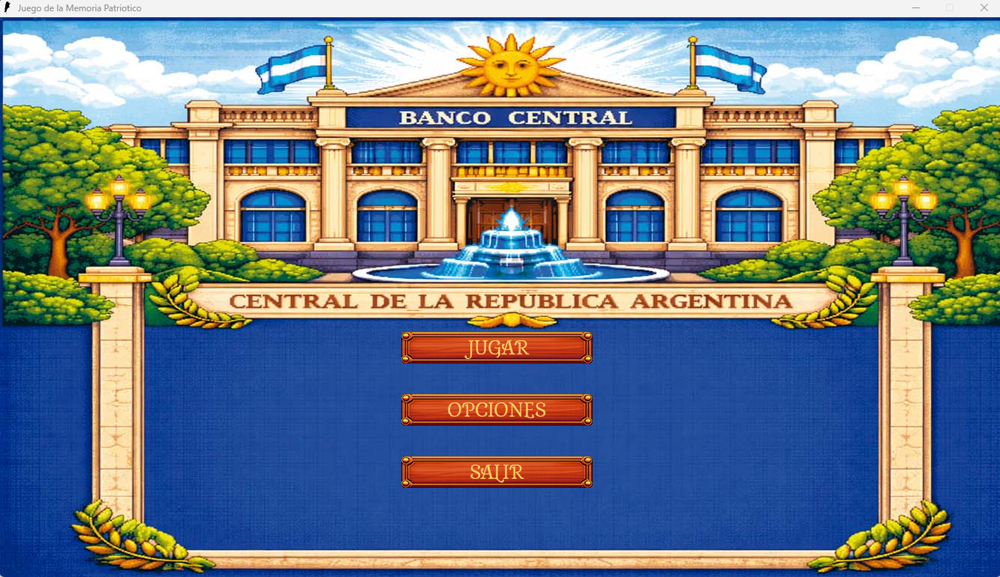
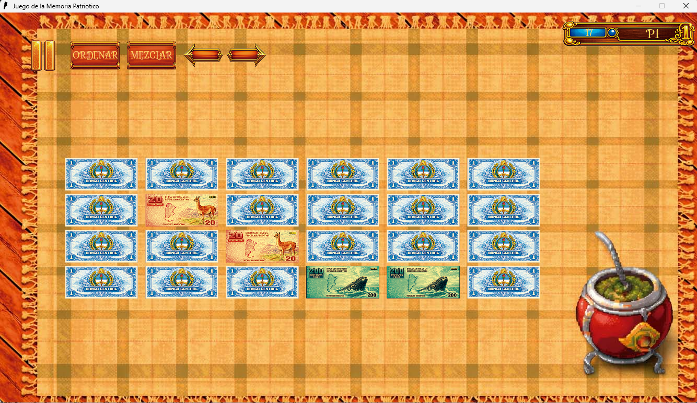
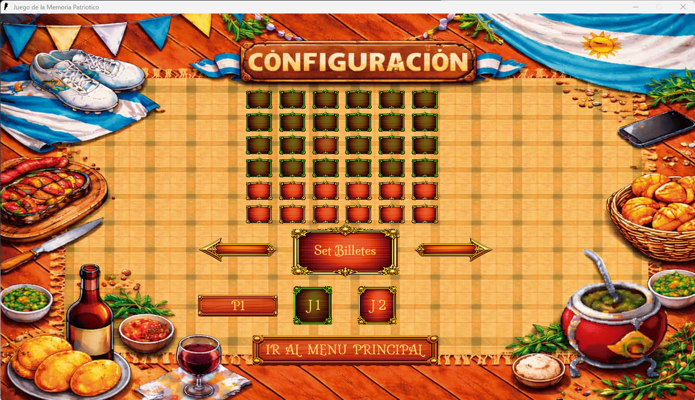
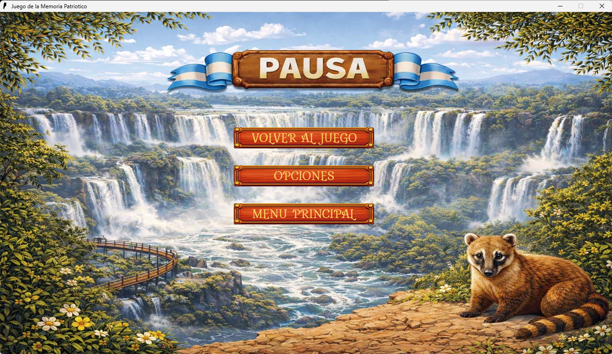

# Memory Game

A classic Memory Game developed in **C** using **SDL2**, originally created in **February 2026** as part of a course at Universidad Nacional de la Matanza (UNLaM).

The project focuses on modular software design, SDL2 integration, event-driven programming, and resource management.

> This repository preserves the project close to its original implementation to showcase my programming evolution. Known limitations are documented below.

  

A classic Memory Game developed in <b>C</b> using <b>SDL2</b>. 
Originally developed in <b>February 2026</b> as part of the Advanced Programming course at UNLaM.

---

## Screenshots

| Main Menu | Gameplay |
|-----------|----------|
|  |  |

| Options | Pause Menu |
|----------|----------------|
|  |  |

---

## Features

- Classic memory game
- SDL2 graphical interface
- Configurable board size
- Multiple image sets
- Main menu
- Options menu
- Pause menu
- HUD
- Configuration file
- Custom SDL text input component
- Modular architecture

---

## Technologies

- C
- SDL2
- SDL_image
- SDL_ttf
- SDL_mixer
- Modular Programming
- Dynamic Memory
- Generic Data Structures

---

## Project Architecture

### Core Modules

| Module | Responsibility |
|---------|----------------|
| `main` | Program entry point. |
| `juego` | Initializes SDL, loads resources, manages state transitions, and owns the main `Game` structure. |
| `estado` | Defines the common interface for every game state using function pointers. |
| `gameplay` | Implements gameplay initialization, event handling, update, rendering, and cleanup. |
| `menu` | Main menu and pause menu implementation. |
| `opciones` | Options/configuration menu. |
| `config` | Loads, validates, updates, and saves the configuration file. Restores default values if necessary. |
| `cargar_recursos` | Loads every asset required by the game. |
| `carta` | Card implementation and matching logic. |
| `button` | Generic SDL button supporting click and toggle behavior. |
| `jugador` | Player statistics and turn management. |
| `inputTxt` | Custom SDL text input component developed specifically for this project. |
| `TDAVectorGenerico` | Generic dynamic array implementation. |
| `errores` | Common error definitions. |

### SDL Utility Modules

The following modules were originally provided by the course staff as SDL abstraction layers and were modified where necessary to fit this project.

| Module | Responsibility |
|---------|----------------|
| `graficos` | Graphics abstraction and texture management. |
| `imagenes` | Image loading (PNG/JPG). |
| `hud` | HUD management and GUI components. Modified to support optional texture destruction. |
| `texto` | SDL_ttf wrapper. |
| `sonidos` | SDL audio wrapper. |

---

## Configuration

The game reads its configuration from a text file.

Currently configurable options include:

- Board dimensions
- Image set
- Player name
- Other gameplay settings

---

## Known Limitation

Originally, the game supported a **4×5 board** (20 cards / 10 image pairs).

Later, support for variable board sizes (such as **6×6**) was implemented. However, the image loading system still assumes a fixed number of image pairs per set.

Because of this:

- Boards requiring more image pairs continue reading textures from the next predefined image set.
- Once the final predefined image set is exhausted, unrelated textures may be loaded.

The issue is fully understood and intentionally left unchanged in this repository.

### Planned Improvement

Replace the hardcoded image loading system with a fully dynamic implementation that automatically detects available assets and generates pairs accordingly.

---

## Future Improvements

- Dynamic asset loading
- Unlimited image sets
- Resolution scaling
- Better animations
- Improved configuration system
- Better UI transitions
- Performance improvements

---

## Third-party Assets

The artwork used in the game was created by a teammate.

Some SDL wrapper modules (`graficos`, `imagenes`, `texto`, `sonidos`, and part of `hud`) were originally provided by the course staff and later modified where necessary for this project.

---

## Building

Open the Code::Blocks project and build it using SDL2.

Required libraries:

- SDL2
- SDL2_image
- SDL2_ttf
- SDL2_mixer

---

## About

This project represents one of my first complete game development projects using C and SDL2.

Although I would approach several design decisions differently today, I intentionally keep the project close to its original implementation to reflect my learning process and software engineering growth over time.
